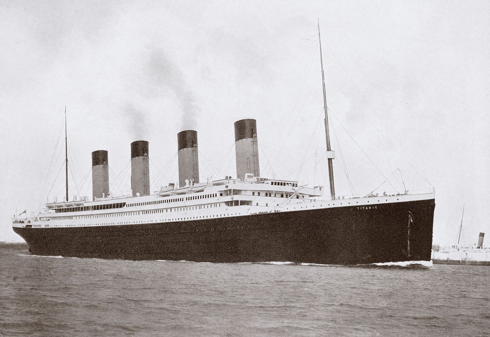

# Titanic Passenger Analysis
By: 
[Yoeri Samwel](https://github.com/yoerisamwel)

<!--  -->

## Built With:

  <table>
    <tr>
      <td align="center" width="96">
        
         Python
      </td>
      <td align="center" width="96">
        
         Jupyter Notebook
      </td>
      <td align="center" width="96">
        
         Power BI 
      </td>
      <td align="center" width="96">
        
          Flask
      </td>
      <td align="center" width="96">
        
          SQLLite
      </td>
    </tr>
  </table>

## Overview
The purpose of this project is to:
  - **Practice reporting skills** and **Practice data analytical skilss:** By analysing the passenger agegroups that were on the Titanic and working with the dataset. 
  - **Loading and storing data:** Loading and storing data in SQLLite.
  - **Flask API:** Developed a Flask App that allows a consumer to pull data from the database by using an API.

## Visualizations
In the Power BI dashboard, I created multiple tabs using bookmarks and buttons to organize the analysis effectively. Each tab focuses on a specific aspect of Titanic passenger demographics, such as age group distributions, gender demographics, and temporal trends.

Using Power Query and DAX, I expanded the analysis to provide deeper insights into the composition of passengers and their journey aboard the Titanic. Power Query enabled me to clean and transform the data, while DAX allowed for complex calculations and custom measures to enhance the visualizations and uncover meaningful patterns.

Overall, the Power BI dashboard offers an interactive and comprehensive exploration of Titanic passenger demographics, thanks to its intuitive design, interactive features, and the utilization of advanced analytical techniques.

## Analysis

I added the data into an SQLLite database. I installed the odbc driver to enable me to use this databse with Power BI. I then explored the data using SQLAlchemy. The next step was loading the data using SQLAlchemy into a pandas dataframe allowing me to run some analysis and create a profile report for the dataset. I then loaded a second passenger list into the datbase and joined the two to complete some missing data. I then developed an analysis in Power BI using Power Query and DAX to process the data and group the data to gain better insights into the agegroups that were present on the Titanic. I then also created an Flask app that allows a use to pull data from the SQLLite server using an API. 

## Summary

In my Titanic passenger analysis project, I embarked on a journey to sharpen my reporting and data analytical skills. Leveraging a combination of Python, Jupyter Notebook, Power BI, and Flask, I delved into the demographics of Titanic passengers with curiosity and rigor.

The project kicked off with the creation of an SQLLite database, where I meticulously stored and managed the Titanic passenger data. This foundational step laid the groundwork for the subsequent analyses, ensuring data integrity and accessibility throughout the project.

Using SQLAlchemy, I navigated through the dataset, extracting insights and generating a comprehensive profile report. This initial exploration provided invaluable insights into the characteristics of the data and set the stage for deeper analyses.

A pivotal aspect of the project involved enriching the dataset by integrating additional passenger data into the database. This meticulous process of data augmentation enabled me to address any missing information and ensure the completeness and accuracy of my analyses.

With the data primed and ready, I turned my attention to developing a Power BI dashboard. Leveraging the power of Power Query and DAX, I crafted interactive visualizations and insightful analyses that brought the demographics of Titanic passengers to life. The dashboard served as a captivating narrative of the age groups present onboard, offering valuable insights into this historic voyage.

Furthermore, I extended the project's reach by implementing a Flask API, empowering users to access the Titanic passenger data directly from the SQLLite database. This seamless integration enhanced the project's accessibility and opened doors for further exploration and utilization of the dataset.

In summary, my Titanic passenger analysis project exemplifies a holistic approach to data analysis, blending technical expertise with a curious investigative mindset. Through meticulous data management, insightful visualization, and user-friendly API implementation, the project not only deepened my understanding of Titanic passenger demographics but also showcased the versatility and power of modern data analysis techniques.

---

### Contact Info:

 

<b> Yoeri Samwel:</b>
  
  
  

  

 ---
